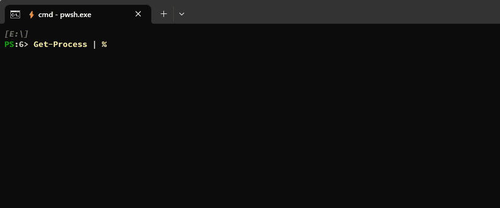

# CompletionPredictor

> **NOTE:** This is an experimental project with no target date for a 1.0 release.

The `CompletionPredictor` is a PowerShell command line auto-completion plugin for the PSReadLine
[Predictive Intellisense](https://devblogs.microsoft.com/powershell/announcing-psreadline-2-1-with-predictive-intellisense/) feature:

This predictor is relatively simple and also serves as an example for you to build your own predictor.

We welcome your feedback and suggestions. Please file issues and submit pull requests in this repository.

## Requirements

The `CompletionPredictor` plugin is built on the [Subsystem Plugin Model][subsystem-plugin-model],
which is available with PowerShell 7.2 or above.
To display prediction suggestions from the `CompletionPredictor`,
you need [PSReadLine 2.2.2](https://www.powershellgallery.com/packages/PSReadLine/2.2.2) or above.

- PowerShell 7.2 or above
- PSReadLine 2.2.2 or above

## Predictor documentation

PowerShell predictors are written in C# and registered with the PowerShell [Subsystem Plugin Model][subsystem-plugin-model].
To learn more, see ["How to create a command-line predictor"]( https://docs.microsoft.com/powershell/scripting/dev-cross-plat/create-cmdline-predictor).

## Build

Make sure the [latest .NET 6 SDK](https://dotnet.microsoft.com/download/dotnet/6.0) is installed and
available in your `PATH` environment variable.
Run `.\build.ps1` from PowerShell to build the project.
The module will be published to `.\bin\CompletionPredictor` by a successful build.

## Use the predictor

> NOTE: Make sure you use PowerShell 7.2 with PSReadLine 2.2.2.

1. Install the module by `Install-Module -Name CompletionPredictor -Repository PSGallery`
1. Import the module to register the plugin with the PSSubsystem: `Import-Module -Name CompletionPredictor`
1. Enable prediction from the plugin source for PSReadLine: `Set-PSReadLineOption -PredictionSource HistoryAndPlugin`
1. Switch between the `Inline` and `List` prediction views, by pressing <kbd>F2</kbd>

[subsystem-plugin-model]: https://docs.microsoft.com/powershell/scripting/learn/experimental-features#pssubsystempluginmodel

## Code of Conduct

Please see our [Code of Conduct](.github/CODE_OF_CONDUCT.md) before participating in this project.

## Security Policy

For any security issues, please see our [Security Policy](.github/SECURITY.md).
